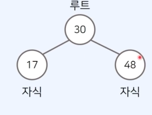
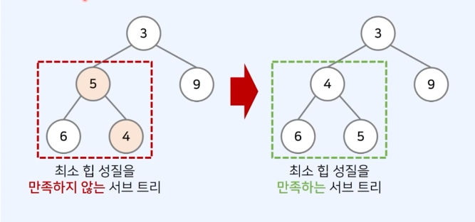

## 자료구조

### 선형 자료구조

- 선형 자료구조는 하나의 데이터 뒤에 다른 데이터가 하나 존재하는 자료구조다.
- 데이터가 일렬로 연속적으로 연결되어 있다.
  예시) 배열, 연결 리스트, 스택, 큐, 덱

### 비선형 자료구조

- 비선형 자료구조는 하나의 데이터 뒤에 다른 데이터가 여러 개 올 수 있는 자료구조다.
- 데이터가 일직선상으로 연결되어 있지 않아도 된다.

예) 트리, 그래프

### 프로그램의 성능 측정 방법

- 시간 복잡도: 알고리즘에 사용되는 연산 횟수
- 공간 복잡도: 알고리즘에 사용되는 메모리의 양을 측정
- 공간을 많이 사용하는 대신 시간을 단축하는 방법이 흔히 사용됨.

### 배열

- 가장 기본적인 자료구조
- 여러 개의 변수를 담는공간
- 배열은 인덱스가 존재하며 인덱스는 0부터 시작
- 특정한 인덱스에 직접적으로 접근 가능 -> 수행 시간:O(1)

특징

- 컴퓨터의 메인 메모리에서 배열의 공간은 연속적으로 할당
- 장점: 캐시 히트 가능성이 높으며 조회가 빠르다.
- 단점: 배열의 크기를 미리 지정해야 하는 것이 일반적이므로, 데이터의 추가 및 삭제에 한계가 있다.

### 연결 리스트

- 연결 리스트는 컴퓨터의 메인 메모리상에서 주소가 연속이지 않다.
- 배열과 다르게 크기가 정해져 있지 않고, 리스트의 크기는 동적으로 변경 가능
- 장점: 포인터를 통해 다음 데이터의 위치를 가리킨다는 점에서 삽입과 삭제 간편
- 단점: 특정 번째의 원소를 검색할 때는 앞에서부터 원소를 찾아야 하므로, 데이터 검색 속도가 느리다.

### 연결 리스트 VS 배열

- 연결 리스트와 배열을 비교하여 장단점을 이해해야 함.
- 특정 위치의 데이터를 삭제할 때, 일반적인 배열에서는 O(N)만큼의 시간이 소요
- 하지만 연결 리스트를 이용하면 단순히 연결만 끊어주면 된다.
- 따라서 삭제할 위치를 정확히 알고 있는 경우 O(1)의 시간이 소요

### 스택

- 스택: 먼저 들어온 데이터가 나중에 나가는 자료구조
- 흔히 박스가 쌓인 형태를 스택이라고 한다.
- 우리가 박스를 쌓은뒤에 꺼낼 때는, 가장 마지막에 올렸던 박스부터 꺼내야 한다.
- 새로운 원소를 삽입할 때는 마지막에 추가
- 새로운 원소를 삭제할 때는 마지막 원소가 삭제

### 연결 리스트로 스택 구현하기

- 스택을 연결 리스트로 구현하면, 삽입과 삭제에 있어서 O(1)을 보장.
- 연결 리스트로 구현할 때는 머리를 가리키는 하나의 개의 포인터만 가진다.
- 머리: 남아 있는 원소 중 가장 마지막에 들어 온 데이터를 가리키는 포인터

### 큐

- 큐는 먼저 삽입된 데이터가 먼저 추출되는 자료구조다.
- 예시) 게임 대기 큐는 먼저 대기한 사람이 먼저 게임에 매칭
- 큐를 연결 리스트로 구현하면, 삽입과 삭제에 잇어서 O(1)를 보장
- 연결 리스트로 구현할 때는 머리와 꼬리 두개의 포인터를 가진다.
- 머리: 남아있는 원소 중 가장 먼저 들어 온 데이터를 가리키는 포인터
- 꼬리: 남아있는 원소 중 가장 마지막에 들어 온 데이터를 가리키는 포인터

### 큐 동작 속도: 배열 VS 배열 리스트

- 다수의 데이터를 삽입 및 삭제할 때에 대하여, 수행 시간을 측정할 수 있다.
- 단순히 배열 자료형을 이용할 때보다 연결 리스트를 사용할 때 수행 시간 관점에서 효율적이다.
- JS에서는 Dictionary 자료형을 이용하여 큐를 구현하면 간단하다.

- 자기만의 템플릿을 가지고 있자. 코테에 큰 도움이 된다.

### 트리

- 트리는 가계도와 같이 계층적인 구조를 표현할 때 사용할 수 있는 자료구조다.

- 나무의 형태를 뒤집은 것과 같이 생겼다.

트리 용어 정리

- 루트 노드: 부모가 없는 최상위 노드
- 단말 노드: 자식이 없는 노드
- 트리에서는 부모와 자식 관계가 성립
- 형제 관계: 17을 값으로 가지는 노드와 48을 가지는 노드 사이의 관계

- 깊이: 루트 노드에서의 길이
- 이때, 길이란 출발 노드에서 목적지 노드까지 거쳐야 하는 간선의 수를 의미
- 트리의 높이는 루트 노드에서 가장 깊은 노드까지의 길이를 의미한다.

### 이진트리

- 이진 트리는 최대 2개의 자식을 가질 수 있는 트리를 말함.

### 우선순위 큐

- 우선순위 큐는 우선순위에 따라서 데이터를 추출하는 자료구조다.
- 컴퓨터 운영체제, 온라인 게임 매칭 등에서 활용된다.
- 우선순위 큐는 일반적으로 힙을 이용해 구현한다.

- 우선순위 큐는 다양한 방법으로 구현할 수 있다.
- 데이터의 개수가 N개일 때, 구현 방식에 따른 시간 복잡도는 다음과 같다.

- 일반적인 형태의 큐는 선형적인 구조를 가진다.
- 반면에 우선순위 큐는 이진 트리구조를 사용하는 것이 일반적이다.

포화 이진 트리

- 포화 이진 트리는 리프 노드를 제외한 모든 노드가 두 자식을 가지고 있는 트리다.

완전 이진 트리

- 완전 이진 트리는 모든 노드가 왼쪽 자식부터 차근차근 채워진 트리이다.

높이 균형 트리

- 왼쪽 자식 트리와 오른쪽 자식 트리의 높이가 1 이상 차이 나지 않는 트리

### 힙

- 힙은 원소들 중에서 최댓값 혹은 최솟값을 빠르게 찾아내는 자료구조
- 최대 힙: 값이 큰 원소부터 추출한다.
- 최소 힙: 값이 작은 원소부터 추출한다.
- 힙은 원소의 삽입과 삭제를 위해 O(logN)의 수행 시간을 요구
- 단순한 N개의 데이터를 힙에 넣었다가 모두 꺼내는 작업은 정렬과 동일하다.
- 이 경우 시간 복잡도는 O(NlogN)이다.

최대 힙

- 최대 힙은 부모 노드가 자식 노드보다 값이 큰 완전 이진 트리를 의미한다.

- 루트 노드는 전체 트리에서 가장 큰 값을 가진다는 특징

힙의 특징

- 힙은 완전 이진 트리 자료구조를 따른다.
- 힙에서는 우선순위가 높은 노드가 루트에 위치한다.

1. 최대 힙

- 부모 노드의 키 값이 자식 노드의 키 값보다 항상 크다.
- 루트 노드가 가장 크며, 값이 큰 데이터가 우선순위를 가진다.

2. 최소 힙

- 부모 노드의 키 값이 자식 노드의 키 값보다 항상 작다.
- 루트 노드가 가장 작으며, 값이 작은 데이터가 우선순위를 가진다.

### 최소 힙 구성 함수: Heapify

- (상향식) 부모로 거슬러 올라가며, 부모보다 자신이 더 작은 경우에 위치를 교체한다.

힙에 새로운 원소가 삽입될 때

- (상향식) 부모로 거슬러 올라가며, 부모보다 자신이 더 작은 경우에 위치를 교체한다.

- 새로운 원소가 삽입되었을 때 O(logN)의 시간 복잡도로 힙 성질을 유지하도록 할 수 있다.

힙에 새로운 원소가 삭제될 때

- 원소가 제거되었을 때 O(logN)의 시간 복잡도로 힙 성질을 유지하도록 할 수 있다.
- 원소를 제거할 떄는 가장 마지막 노드가 루트 노드의 위치에 오도록 한다.

### 그래프의 표현

- 그래프란 사물을 정점과 간선으로 나타내기 위한 도구
- 그래프는 두 가지 방식으로 구현할 수 있다.

1. 인접 행렬: 2차원 배열을 사용하는 방식
2. 인접 리스트: 연결 리스트를 이용하는 방식

인접 행렬

- 인접 행렬에서는 그래프를 2차원 배열로 표현

행이 시작 노드

열이 특정 시작 노드에서 도착 노드로 가기 위한 비용

인접 행렬 - 무방향 무가중치 그래프

- 모든 간선이 방향성을 가지지 않는 그래프를 무방향 그래프라고 함.
- 모든 간선에 가중치가 없는 그래프를 무가중치 그래프라고 함.
- 무방향 비가중치 그래프가 주어졌을 때 연결되어 있는 상황을 인접 행렬로 출력할 수 있다.

인접 행렬 - 방향 가중치 그래프

- 모든 간선이 방향을 가지는 그래프를 방향 그래프라고 한다.
- 모든 간선에 가중치가 있는 그래프를 가중치 그래프라고 한다.
- 방향 가중치 그래프가 주어졌을 때 연결되어 있는 상황을 인접 행렬로 출력할 수 있다.

인접 리스트

인접 리스트에서는 그래프를 리스트로 표현

인접 리스트 - 무방향 무가중치 그래프

- 모든 간선이 방향성을 가지지 않는 그래프를 무방향 그래프라고 함.
- 모든 간선에 가중치가 없는 그래프를 무가중치 그래프라고 함.
- 무방향 비가중치 그래프가 주어졌을 때 연결되어 있는 상황을 인접 리스트로 출력할 수 있다.

인접 리스트 - 방향 가중치 그래프

- 모든 간선이 방향을 가지는 그래프를 방향 그래프라고 함.
- 모든 간선에 가중치가 있는 그래프를 가중치 그래프라고 함.
- 방향 가중치 그래프가 주어졌을 때 연결되어 있는 상황을 인접 리스트로 출력함.

그래프의 시간 복잡도

1. 인접 행렬: 모든 정점들의 연결 여부를 저장해 O(V2)의 공간을 요구함.

- 공간 효율성이 떨어지지만, 두 노드의 연결 여부를 O(1)에 확인할 수 있다.

2. 인접 리스트: 연결된 간선의 정보만을 저장하여 O(V+E)의 공간을 요구

- 공간 효율성이 우수하지만, 두 노드의 연결 여부를 확인하기 위해 O(V)의 시간이필요하다.

인접 행렬vs 인접 리스트

- 최단 경로 알고리즘을 구현할 때, 어떤 자료구조가 유용
- 각각 근처의 노드와 연결되어 있는 경우가 많으므로, 간선 개수가 적어 인접 리스트가 유리하다.
