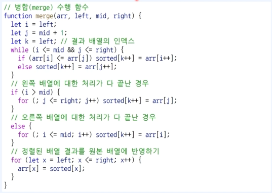

## Javascript 정렬 알고리즘

## 선택 정렬

- 선택 정렬은 매 단계에서 가장 작은 원소를 선택해서 앞으로 보내는 정렬 방법
- 앞으로 보내진 원소는 더 이상 위치가 변경되지 않는다.
- 시간 복잡도O(N2)로 비효율적인 정렬 알고리즘 중 하나다.

### 선택 정렬의 동작 방식

1. 각 단계에서 가장 작은 원소를 선택한다.
2. 현재까지 처리되지 않은 원소들 중 가장 앞의 원소와 위치를 교체한다.

## 버블 정렬

- 단순히 인접한 두 원소를 확인하여, 정렬이 안되어 있다면 위치를 서로 변경한다.
- 서로 인접한 두 원소를 비교하는 형태가 거품과 같다고 하여 붙여진 이름
- 시간 복잡도 O(N2)로 비효율적인 정렬 알고리즘 중 하나다.
- 각 단계에서는 인접한 두 개의 원소를 비교하여, 필요시 위치를 변경한다.
- 첫째와 둘째를 비교, 둘째와 셋째를 비교, 셋째와 넷째를 비교하는 방식
- 한번의 단계가 수행되면, 가장 큰 원소가 맨 뒤로 이동한다.
- 따라서 그 다음 단계에서는 맨 뒤로 이동한 데이터는 정렬에서 제외

## 삽입 정렬

- 삽입 정렬이란 각 숫자를 적절한 위치에 삽입하는 정렬 기법

### 삽입 정렬 동작 방식

1. 각 단계에서 현재 원소가 삽입될 위치를 찾는다
2. 적절한 위치에 도달할 때까지 반복적으로 왼쪽으로 이동한다.

## 병합 정렬

- 병합 정렬은 전형적인 분할 정복 알고리즘이다.

### 분할 정복

1. 분할: 큰 문제를 작은 부분 문제로 분할한다.
2. 정복: 작은 부분 문제를 각각 해결한다.
3. 조합: 해결한 부분 문제의 답을 이용하여 다시 큰 문제를 해결한다.

- 분할 정복은 일반적으로 재귀 함수를 이용하여 구현
- 그 이유는? 큰 문제를 작은 문제로 분할하는 방식이 동일한 경우가 많기 때문
- 더 이상 쪼갤 수 없는 크기가 될 때까지 계속하여 분할

### 분할 정복의 단점

- 일반적으로 재귀 함수를 사용한다는 점에서 함수 호출 횟수가 많이 발생
- 이는 오버헤드로 이어짐.

### 병합 정렬의 특징

- 시간 복잡도 O(NlogN)을 보장하는 빠른 정렬 알고리즘 중 하나

### 병합 정렬의 동작 방식

- 병합 정렬은 분할 정복을 이용하는 가장 기본적인 정렬 알고리즘

1. 분할: 정렬할 배열을 같은 크기의 부분 배열 2개로 분할
2. 정복: 부분 배열을 정렬
3. 조합: 정렬된 부분 배열을 하나의 배열로 다시 병합.

### 병합 정렬의 동작 방식 - 정복

- 각 부분 배열은 이미 정렬된 상태로 본다.
- 각 부분 배열에 대하여 첫째 원소부터 시작하여 하나씩 확인
- 총 원소의 개수가 N개일 때, O(N)의 시간 복잡도가 요구된다.

분할을 수행하는 코드

### 정렬 라이브러리

- JavaScript에서는 배열에 포함된 데이터를 정렬하는 sort() 함수를 제공
- 최악의 경우 시간 복잡도 n(NlogN)을 보장한다.
- 알고리즘 및 코딩 테스트 문제를 해결할 때 정렬 기능이 필요하다면, 단순히 sort() 함수를 사용하는 것을 권장
- 만약, sort() 함수의 사용이 제한된다면, 병합 정렬과 같은 알고리즘을 직접 구현하자.
