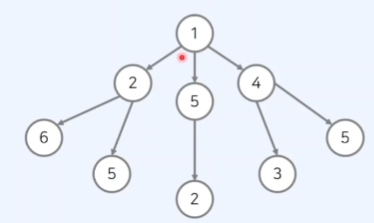

## 탐욕법 알고리즘

- 현재 상황에서 당장 가장 좋아 보이는 상황만을 선택하는 알고리즘
- 흔히 그리디 알고리즘, 혹은 탐욕법이라고 불리기도 한다.
- 최적의 해를 구하기 위한 근사적인 방법으로 사용될 때가 많다.

### 탐욕 알고리즘 예시

- 루트에서 출발하여 단말 노드까지 가는 경우를 생각해보자
- 거쳐가는 노드의 합이 가장 큰 경우는?
- 최적의 해는 10이다.
  

### 탐욕 알고리즘과 근사 해

- 현실 세계의 많은 상황에서는, 단순한 탐욕 알고리즘으로는 최적의 해를 놓칠 수 있다.
- 하지만, 최적의 해에 가까운 답을 뱉는 것을 고려하면 현실에서의 다양한 프로그램에서 "근사해"를 구하는 목적으로 사용되곤 함.

### 코딩테스트에서의 탐욕 알고리즘

- 일반적인 채점 시스템은 시험 참가자의 코드 결과가 정해진 결과와 같은지 확인
- 코딩 테스트에서 탐욕 알고리즘 문제가 출제되는 경우를 생각해보자
- 일반적으로 탐욕 알고리즘 유형에서는 탐욕 방법으로 최적의 해가 보장되는 문제가 출제된다.

### 탐욕 알고리즘의 접근 방법

- 탐욕 알고리즘 문제를 해결할 떄는 일반적으로 다음의 과정을 거친다.

1. 방법 고안하기: 현재 상황에서 어떤 것을 선택할지 알고리즘을 고안한다.
2. 정당성 확인하기: 자신이 고안한 알고리즘이 항상 최적의 해를 보장하는 지 확인한다.(증명 단계)

### 거스름 돈 문제

- 거스름 돈 문제는 전형적인 탐욕 알고리즘의 예시다.
- 카운터에 500원, 100원, 50원, 10원짜리 동전이 무수히 많이 존재한다.
- 손님에게 6,480원을 거슬러 주어야 할 때, 동전 개수의 최솟값은?

### 거스름 돈 문제의 해법

- 이 문제의 해결 방법은, 가장 큰 화폐 단위부터 거슬러주는 것
- 따라서, 다음의 4단계를 거쳐 정답을 도출할 수 있다.

1. 500원으로 거슬러 줄 수 있는 만큼 거슬러 준다.
2. 100원으로 거슬러 줄 수 있는 만큼 거슬러 준다.
3. 50원으로 거슬러 줄 수 있을 만큼 거슬러 준다.
4. 10원으로 거슬러 줄 수 있을 만큼 거슬러 준다.

- 거스름 돈 문제의 해법은 다음과 같다.
  [1단계] 500원으로 거슬러 줄 수 있는 만큼 거슬러 준다.

현재 금액 남은 금액
6480원 480원

- 현재까지 사용한 동전 수:12개

[2단계] 100원으로 거슬러 줄 수 있는 만큼 거슬러 준다.

현재 금액 남은 금액
480원 80원

- 현재까지 사용한 동전 수:12+4개

[3단계] 50원으로 거슬러 줄 수 있는 만큼 거슬러 준다.

현재 금액 남은 금액
80원 30원

- 현재까지 사용한 동전 수:12+4+1개

[4단계] 10원으로 거슬러 줄 수 있는 만큼 거슬러 준다.

현재 금액 남은 금액
30원 0원

- 현재까지 사용한 동전 수:12+4+1+3개

### 거스름 돈 문제의 해법 정당성 분석

- 단순히 큰 화폐 단위부터 선택하여 최적의 해를 찾을 수 있는 이유는 무엇일까?
- 그 이유는, 각 화폐 단위가 배수 관계에 속하기 때문
  [예시] 120원을 거슬러 주어야 할 때, 80원, 60원, 10원 동전이 있다면?
- 최적의 해: 60원 X 2= 120원으로 2개의 동전이 필요하다.
- 80원부터 거슬러 준다면, 총 5개의 동전이 필요할 것.
